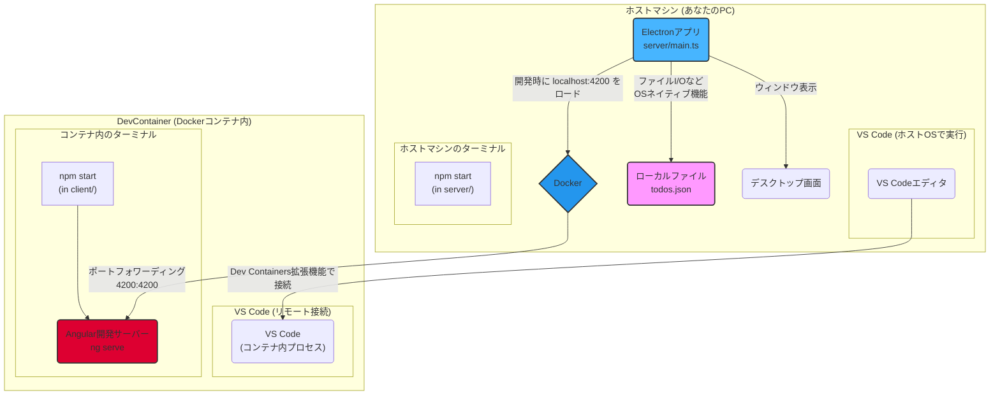

# Angular + Electron TODO アプリ 開発ガイド

このプロジェクトは、フロントエンドに Angular、デスクトップアプリケーションのガワ（外側）に Electron を使用した TODO アプリのサンプルです。

このドキュメントは、新しいプロジェクトメンバーが開発環境をセットアップし、スムーズに開発へ参加できるようガイドすることを目的としています。

## 1. このプロジェクトのアーキテクチャ概要

このプロジェクトは、開発の安定性と効率性を両立させるため、少し特殊な**ハイブリッド開発環境**を採用しています。

- **フロントエンド (Angular):** **DevContainer (Docker コンテナ) 内**で開発します。

  - Node.js や Angular CLI のバージョン、VS Code 拡張機能などがコンテナにパッケージ化されており、誰の PC でも全く同じクリーンな開発環境を再現できます。
  - 担当範囲: UI の見た目、コンポーネント、状態管理など。(`client` フォルダ)

- **バックエンド (Electron):** **ホストマシン (あなたの PC)** で直接開発・実行します。
  - OS ネイティブの GUI 機能やファイルシステムにアクセスするため、コンテナ環境で起こりがちな描画エラーや互換性の問題を完全に回避し、安定した動作を保証します。
  - 担当範囲: ウィンドウ作成、メニュー、ファイル保存/読み込みなどの OS 連携機能。(`server` フォルダ)



### この構成のメリット

- **環境構築の再現性:** Angular の開発環境は Docker で完全に固定化。`npm install`だけで全員が同じ環境で作業でき、「私の PC では動かない」問題を撲滅します。
- **安定した実行環境:** Electron をホスト OS で直接動かすことで、仮想環境特有の GUI 関連のクラッシュやライブラリ不足エラーに悩まされることがありません。
- **関心の分離:** `client` (UI) と `server` (ネイティブ機能) の役割がフォルダレベルで明確に分かれているため、コードの見通しが良く、分業しやすくなります。
- **快適な開発体験:** Angular のホットリロード機能はそのまま利用可能。UI コードを変更すれば、Electron ウィンドウ内の画面が即座に更新されます。

### 注意点

- **2 つのターミナル:** 開発時には「DevContainer 内のターミナル（Angular 用）」と「ホストマシンのターミナル（Electron 用）」の 2 つを同時に使用します。どちらでコマンドを実行しているか常に意識する必要があります。
- **`node_modules`が 2 つ存在する:** `client/node_modules`はコンテナ内に、`server/node_modules`はホストマシン上に作成されます。混同しないように注意してください。

---

## 2. 開発環境のセットアップ手順

開発を始めるために、以下の手順を一度だけ実行してください。

### Step 0: 事前準備

お使いの PC（ホストマシン）に以下のソフトウェアがインストールされていることを確認してください。

1.  **Git:** [公式サイト](https://git-scm.com/)からダウンロードしてインストール。
2.  **Docker Desktop:** [公式サイト](https://www.docker.com/products/docker-desktop/)からダウンロードしてインストール。起動しておいてください。
3.  **Visual Studio Code (VS Code):** [公式サイト](https://code.visualstudio.com/)からダウンロードしてインストール。
4.  **VS Code 拡張機能 "Dev Containers":** VS Code の拡張機能マーケットプレイスで `ms-vscode-remote.remote-containers` を検索してインストール。
5.  **Node.js (LTS 版):** [公式サイト](https://nodejs.org/ja)からダウンロードしてインストール。Electron をホストマシンで動かすために必要です。

### Step 1: プロジェクトのクローン

このリポジトリをローカルマシンにクローンします。

```bash
git clone <リポジトリのURL>
cd angular-electron-todo
```

### Step 2: VS Code でプロジェクトを開き、DevContainer を起動

1.  クローンした `angular-electron-todo` フォルダを VS Code で開きます。
    ```bash
    code .
    ```
2.  VS Code が `.devcontainer` フォルダを検知し、右下に **「Reopen in Container」** というポップアップが表示されます。これをクリックしてください。
    - (表示されない場合: `F1`キー > `Dev Containers: Reopen in Container` を実行)
3.  初回は Docker イメージのビルドに数分かかります。完了すると、VS Code の左下が「Dev Container: ...」という表示に変わります。これであなたはコンテナの中で作業している状態です。

### Step 3: 依存パッケージのインストール

環境のセットアップは、以下の 2 つのパートに分かれます。

#### 3-A: Angular の依存関係をインストール (DevContainer 内)

VS Code に統合されているターミナル（`Ctrl + @` または `Terminal > New Terminal`）を開き、以下のコマンドを実行します。これは**コンテナ内**での作業です。

```bash
# DevContainer内のターミナルで実行
cd /workspaces/client
npm install
```

#### 3-B: Electron の依存関係をインストール (ホストマシン上)

**VS Code とは別に、お使いの PC のターミナル**（Windows なら PowerShell、Mac ならターミナル.app など）を起動し、プロジェクトフォルダに移動して以下のコマンドを実行します。

```bash
# ホストマシンのターミナルで実行
# cd <プロジェクトをクローンした場所>/angular-electron-todo/server
cd server
npm install
```

これで全てのセットアップは完了です！

---

## 3. 開発ワークフロー

アプリケーションを起動し、開発を始めるための手順です。

### Step 1: Angular 開発サーバーを起動 (DevContainer 内)

1.  **VS Code のターミナル**を開きます。
2.  `client` フォルダに移動し、Angular の開発サーバーを起動します。

    ```bash
    # DevContainer内のターミナルで実行
    cd /workspaces/client
    npm start -- --host 0.0.0.0
    ```

3.  `Compiled successfully`と表示されたら成功です。このターミナルは起動したままにしておきます。

### Step 2: Electron アプリを起動 (ホストマシン上)

1.  **ホストマシンのターミナル**を開きます。
2.  `server` フォルダに移動し、Electron アプリを起動します。

    ```bash
    # ホストマシンのターミナルで実行
    cd server
    npm start
    ```

成功すると、デスクトップに TODO アプリのウィンドウが表示されます。

### コードの変更と反映

- **UI の変更:** `client` フォルダ内の Angular コード (`.ts`, `.html`, `.scss`) を変更して保存すると、Electron ウィンドウが自動的にリロードされ、変更が即座に反映されます。
- **ネイティブ機能の変更:** `server` フォルダ内の Electron コード (`main.ts`, `preload.ts`) を変更した場合、ホストマシンのターミナルで `Ctrl+C` を押して Electron を一度停止し、再度 `npm start` で起動し直してください。

---

## 4. プロジェクト構成

```
angular-electron-todo/
├── .devcontainer/         # DevContainer設定フォルダ (Angular開発環境を定義)
│   ├── devcontainer.json
│   ├── docker-compose.yml
│   └── Dockerfile
├── client/                # ★ フロントエンド (Angular) プロジェクト
│   ├── src/
│   └── package.json       # Angularの依存関係
├── server/                # ★ バックエンド (Electron) プロジェクト
│   ├── src/
│   │   ├── main.ts        # Electronのメインプロセス (ウィンドウ作成など)
│   │   └── preload.ts     # フロント(Angular)とバック(Electron)の安全な橋渡し役
│   └── package.json       # Electronの依存関係
└── README.md              # (このファイル)
```

開発の際は、主に `client/src` と `server/src` の中のファイルを編集することになります。

---

## 5. (補足) 本番ビルドの方法

アプリケーションを配布可能な形式（`.exe`, `.dmg`など）にビルドする手順です。

1.  **Angular アプリの本番ビルド (DevContainer 内)**

    ```bash
    # DevContainer内のターミナルで実行
    cd /workspaces/client
    npm run build
    ```

    これにより、最適化されたファイルが `client/dist/todo-app` に生成されます。

2.  **Electron アプリのパッケージ化 (ホストマシン上)**
    ```bash
    # ホストマシンのターミナルで実行
    cd server
    npm run package
    ```
    これにより、`server/release` フォルダに実行可能なアプリケーションファイルが生成されます。

## 6. (補足) 開発モードと本番モードの自動切り替えについて

このプロジェクトでは、実行時の状況に応じて読み込むコンテンツを自動で切り替える仕組みが実装されています。この仕組みを理解することは、トラブルシューティングや機能追加の際に非常に重要です。

**場所:** `server/src/main.ts`

```typescript
// main.ts 内のロジック
const isDev = !app.isPackaged;

// ...

if (isDev) {
  // 開発モードの場合
  mainWindow.loadURL("http://localhost:4200");
} else {
  // 本番モードの場合
  loadURL(mainWindow);
}
```

### 仕組みの解説

- **`const isDev = !app.isPackaged;`**

  - Electron は、アプリがパッケージ化されている（本番配布形式になっている）かどうかを判定する `app.isPackaged` という便利なプロパティを提供しています。
  - `npm start` で開発している間は `app.isPackaged` は `false` となり、`isDev` は `true` になります。
  - `npm run package` でビルドしたアプリを実行すると `app.isPackaged` は `true` となり、`isDev` は `false` になります。
  - これにより、開発時と本番時を確実に区別しています。

- **開発モード (`isDev === true`)**

  - Angular の開発サーバー (`http://localhost:4200`) を直接読み込みます。
  - これにより、Angular の**ホットリロード機能**（コードを保存すると即座に画面が更新される機能）の恩恵を最大限に受けることができ、UI 開発が非常に快適になります。

- **本番モード (`isDev === false`)**
  - `electron-serve`ライブラリを使って、**パッケージ内に同梱されたビルド済みの Angular ファイル** (`index.html`など) を読み込みます。
  - これにより、インターネット接続がない環境でも動作する、自己完結したスタンドアロンのデスクトップアプリケーションとして機能します。

この自動切り替えにより、開発者は特別な操作をすることなく、開発の効率性と本番配布時の信頼性を両立させることができます。

---

## 7. Angular + Electron 開発のベストプラクティス

このセクションでは、Angular と Electron を連携させて堅牢でメンテナンス性の高いアプリケーションを構築するための重要なポイント、注意点、そして避けるべきアンチパターンについて解説します。

### 7.1 プロセス間通信 (IPC) の設計思想

Electron の最も重要な概念は**プロセス**です。

- **メインプロセス (`main.ts`):** 1 つだけ存在。ウィンドウ作成、ファイル操作、OS ネイティブ機能など、バックエンド処理の全てを担当します。Node.js の全機能にアクセスできます。
- **レンダラープロセス (`app.component.ts`など):** ウィンドウごとに 1 つ存在。HTML/CSS/JS で UI を描画します。Angular コードが実行されるのはこのプロセスです。セキュリティ上の理由から、Node.js や Electron の API には直接アクセスできません。

この 2 つのプロセスは完全に隔離されており、**IPC (Inter-Process Communication)** という決められた方法でしか通信できません。

#### :white_check_mark: ベストプラクティス: `preload.js`を唯一の架け橋とする

`preload.js`は、メインプロセスとレンダラープロセスの両方の世界にアクセスできる特殊なスクリプトです。

- **役割:** メインプロセスの機能（ファイル読み書きなど）を、安全な API としてレンダラープロセス（Angular）に公開（`exposeInMainWorld`）します。
- **ルール:** Angular 側からは、`preload.js`で定義された API（例: `window.electronAPI.saveTodos()`）のみを呼び出します。これにより、UI コードが OS の危険な機能に直接アクセスするのを防ぎ、責務が明確になります。

#### :x: アンチパターン: レンダラープロセスで Node.js を有効にする

Electron の古いチュートリアルには、`webPreferences`で`nodeIntegration: true`を設定する方法が紹介されていることがあります。

```javascript
// アンチパターン：絶対に避けるべき設定
new BrowserWindow({
  webPreferences: {
    nodeIntegration: true, // これを有効にすると...
    contextIsolation: false, // レンダラープロセスからfsなどのNode.jsモジュールが直接呼べてしまう
  },
});
```

これは**重大なセキュリティ脆弱性**を生み出します。Web コンテンツ（例えば、外部サイトの画像やスクリプト）を表示した場合、悪意のあるコードがあなたの PC のファイルを削除したり、情報を盗んだりする可能性があります。**`nodeIntegration`は常に`false`、`contextIsolation`は常に`true`にしてください。**

### 7.2 状態管理とデータの永続化

#### :white_check_mark: ベストプラクティス: 状態変更をトリガーにファイル保存を行う

- **データの流れ:**

  1.  Angular コンポーネントでユーザー操作（タスク追加など）が発生。
  2.  コンポーネント内の状態（`todos`配列など）を更新する。
  3.  状態更新後、`saveTodosToFile()`のようなメソッドを呼び出し、`preload.js`経由でメインプロセスに現在の状態データを丸ごと渡す。
  4.  メインプロセスは受け取ったデータをファイルに書き込む。

- **起動時のデータ読み込み:**
  1.  Angular の`ngOnInit`ライフサイクルフックで、`preload.js`経由でメインプロセスにデータ読み込みをリクエストする。
  2.  メインプロセスはファイルからデータを読み込み、その内容を返す。
  3.  Angular は受け取ったデータでコンポーネントの状態を初期化する。

この「UI の状態が正、ファイルは従」という一方向のデータフローは、アプリケーションの動作を予測可能にし、バグを減らします。

#### :x: アンチパターン: UI 操作のたびに細かく IPC 通信を行う

例えば、入力フォームの 1 文字入力ごとに IPC でメインプロセスに通知する、といった設計は避けるべきです。IPC 通信にはオーバーヘッドがあり、頻繁に行うとパフォーマンスが低下する可能性があります。状態の更新はまず Angular 内で完結させ、**意味のある単位（タスクの追加、削除など）で**メインプロセスに通知・保存依頼するのが効率的です。

### 7.3 Angular の変更検知と Electron API の連携

#### :white_check_mark: ベストプラクティス: `NgZone`を使って UI を確実に更新する

Electron の API 呼び出し (`window.electronAPI.loadTodos()`) は、Angular の変更検知システムの管理外で行われる非同期処理です。API からデータを受け取ってコンポーネントのプロパティを更新しても、Angular はそれに気づけず、画面が更新されないことがあります。

これを解決するのが`NgZone`です。

```typescript
// AppComponent内
constructor(private zone: NgZone) {}

async loadTodosFromFile(): Promise<void> {
  const loadedTodos = await window.electronAPI.loadTodos();

  // NgZone.run() で囲むことで、Angularに変更を通知し、UIを更新させる
  this.zone.run(() => {
    this.todos = loadedTodos;
  });
}
```

Electron からデータを受け取る非同期処理のコールバックは、常に`NgZone.run()`でラップする習慣をつけましょう。

### 7.4 開発と本番の環境差異を吸収する

開発時（Angular 開発サーバーを読み込む）と本番時（ビルドされたファイルを読み込む）では、コンテンツの読み込み元が異なります。

#### :white_check_mark: ベストプラクティス: `app.isPackaged`で処理を分岐する

Electron が提供する`app.isPackaged`プロパティは、アプリがパッケージ化された（本番）状態か、ソースコードから直接実行されている（開発）状態かを判定するのに非常に便利です。

```typescript
// main.ts内
const isDev = !app.isPackaged;

if (isDev) {
  // 開発モード：Angularの開発サーバーに接続
  mainWindow.loadURL("http://localhost:4200");
  mainWindow.webContents.openDevTools(); // 開発ツールを開く
} else {
  // 本番モード：ビルド済みのローカルファイルをロード
  loadURL(mainWindow);
}
```

これにより、1 つのコードベースで開発時と本番時の両方に対応できます。

---

## 8. トラブルシューティング / よくあるエラーと対策

開発中やビルド後に発生しがちな代表的なエラーとその解決策をまとめます。問題が発生した場合は、まずこちらを確認してください。

---

### **問題 1: `npm start` 実行時、Electron が起動せず `SIGTRAP` エラーが出る (DevContainer 内)**

- **現象:** DevContainer 内で Electron を起動しようとすると、`exited with signal SIGTRAP` というエラーでクラッシュする。
- **原因:** DevContainer の仮想環境と Electron の GUI 描画システム（ハードウェアアクセラレーションやサンドボックス機能）との非互換性。
- **対策:** このプロジェクトでは、この問題を根本的に回避するため、**Electron をホストマシンで直接実行する**アーキテクチャを採用しています。もし DevContainer 内で Electron を動かそうとしてこのエラーに遭遇した場合は、開発手順が正しいか（Angular はコンテナ内、Electron はホストマシン）を再確認してください。

---

### **問題 2: ビルドしたアプリ(`.exe`等)を実行すると、画面が真っ白になる**

- **現象:** `npm run package`で生成された実行ファイルを開いても、ウィンドウが表示されるだけで中身が真っ白。Developer Tools を見ると、ファイルが見つからない(404)エラーが出ている。
- **原因:**
  1.  **ベースパスが正しくない:** Angular がビルドした`index.html`の基準パス（`<base href>`）が、Web サーバー向けの`/`になっているため、ローカルファイル環境(`file://`)で CSS や JS ファイルを見つけられない。
  2.  **ファイルパスの解決ができていない:** 本番パッケージ内のファイル構造は開発時と異なるため、Electron が`index.html`の場所を正しく認識できていない。
- **対策:** 以下の 2 点を確認・修正してください。
  1.  **`client/src/index.html`** を開き、`<base href="/">` を `<base href="./">` に修正します。これにより、すべてのパスが`index.html`からの相対パスで解決されるようになります。
  2.  **`server/src/main.ts`** の本番モード(`else`ブロック)で、`electron-serve`が正しいディレクトリを指すようにします。具体的には `path.join(app.getAppPath(), '../app')` のような記述で、パッケージ内のリソースディレクトリを正しく指定します。 (※本プロジェクトのコードは既に対策済みです)

---

### **問題 3: ビルドしたアプリ起動時にエラーダイアログが表示される**

- **エラーメッセージ:** `Error: protocol.registerSchemesAsPrivileged should be called before app is ready`
- **原因:** `electron-serve`ライブラリの初期化処理は、Electron のアプリケーション準備が完了する前(`app`の`ready`イベント発生前)に実行する必要があります。この処理を`ready`イベントのコールバック内（例: `createWindow`関数の中）で呼び出してしまうと、タイミングが遅すぎてエラーになります。
- **対策:** `server/src/main.ts`内で、`electron-serve`を`require`して初期化する処理を、スクリプトのトップレベル（`app.on('ready', ...)`よりも前）に移動させます。これにより、アプリの準備が始まる前に、必要なプロトコルの登録が完了します。 (※本プロジェクトのコードは既に対策済みです)

---

### **問題 4: ライブラリのバージョン違いによる `ERR_REQUIRE_ESM` エラー**

- **エラーメッセージ:** `require() of ES Module ... not supported.`
- **原因:** プロジェクトが採用しているモジュールシステム（CommonJS, `require`）と、インストールしたライブラリが提供するモジュールシステム（ES Modules, `import`）が異なっているためです。近年のライブラリは ES Modules 形式のみで提供されることが増えています。
- **対策:**
  1.  **推奨:** 今回のプロジェクトのように、CommonJS をサポートしている旧バージョンのライブラリを明示的にインストールする (`例: npm install electron-serve@^1.3.0`)。
  2.  **上級:** プロジェクト全体を ES Modules 形式に移行する（`tsconfig.json`の`"module": "NodeNext"`への変更、`package.json`への`"type": "module"`の追加など、多くの変更が必要）。

---

## Appendix

### `electron-serve`とは？

一言で言うと、**「ビルドした Web アプリ（Angular や React など）を、Electron の本番環境で、あたかも Web サーバーから配信されているかのように見せかけるためのライブラリ」**です。

### `electron-serve`がない世界で起こる不便

Electron の本番アプリがビルド済みの Angular アプリを読み込む方法は、`mainWindow.loadFile()`という API を使うのが最も直接的です。

```typescript
// もしelectron-serveを使わなかった場合のmain.ts (本番モード部分)

// ...
else {
  // 本番モード
  const indexPath = path.join(app.getAppPath(), '../app/index.html');
  mainWindow.loadFile(indexPath);
}
// ...
```

この`loadFile`を使うと、アプリケーションは内部的に`file:///C:/Users/.../index.html`のような URL でページを開きます。この**`file://`プロトコル**が、多くの不便や問題の根源となります。

#### 不便 1: Web のセキュリティ機能との非互換性

現代の Web ブラウザ（Electron の内部も同様）は、セキュリティのために`http://`や`https://`プロトコルを前提とした機能が多くあります。`file://`プロトコルはこれらの前提から外れるため、予期せぬ制限を受けます。

- **CORS (Cross-Origin Resource Sharing) エラー:**
  - アプリ内から外部の Web API（例: 天気情報 API など）を`fetch`で呼び出そうとすると、高確率で CORS エラーが発生します。`file://`オリジンからのリクエストは、多くのサーバーでブロックされるためです。
- **Cookie や LocalStorage の挙動不安定:**
  - `file://`はオリジンが`null`として扱われることがあり、Web ストレージへのデータの保存がブラウザやバージョンによって拒否されたり、不安定になったりするケースがあります。データの永続化に問題が生じる可能性があります。

#### 不便 2: モダンな Web フレームワークのルーティングが機能しない

Angular Router のような「HTML5 PushState」を利用したルーティングは、URL のパス部分（例: `/users/123`）を変更して画面を切り替えます。

- `file:///.../index.html`の状態で`/users/123`に遷移しようとすると、ブラウザは`file:///.../users/123`という**存在しないファイル**を探しに行ってしまい、アプリが壊れます。
- これを避けるには、URL に`#`を付ける「ハッシュベース」のルーティング（例: `/#/users/123`）に切り替える必要がありますが、URL の見栄えが悪くなるなどのデメリットがあります。

#### 不便 3: 自前での実装が非常に複雑で面倒

上記の`file://`プロトコルの問題を解決するためには、Electron の`protocol` API を使って、`app://`のような**独自のカスタムプロトコル**を自前で実装する必要があります。

そのコードは以下のようになります。

```typescript
// もしelectron-serveの機能を自前で実装しようとしたら...

// 1. appがreadyになる前にカスタムプロトコルを"特権付き"で登録
protocol.registerSchemesAsPrivileged([
  {
    scheme: "app",
    privileges: { standard: true, secure: true, corsEnabled: true },
  },
]);

// 2. appがreadyになった後、リクエストのハンドリングを実装
app.whenReady().then(() => {
  protocol.registerFileProtocol("app", (request, callback) => {
    // 'app://index.html' -> '.../app/index.html' のようにパスを変換
    const url = request.url.substr("app://".length);
    const filePath = path.join(app.getAppPath(), "../app", url);
    callback({ path: filePath });
  });

  createWindow();
});

// 3. ウィンドウでカスタムプロトコルを読み込む
function createWindow() {
  // ...
  mainWindow.loadURL("app://index.html");
}
```

この実装には、以下のような難しさがあります。

- `registerSchemesAsPrivileged`と`registerFileProtocol`の呼び出しタイミングを正確に管理する必要がある（上記問題３エラーの原因にもなりました）。
- URL のパースやファイルパスの変換ロジックを自分で書く必要があり、バグが入り込みやすい。
- ルーティングに対応するため、存在しないパスへのリクエストが来たら`index.html`を返す、といったフォールバック処理も自前で実装する必要がある。

---

### まとめ: `electron-serve`がもたらす絶大なメリット

`electron-serve`は、上記で述べた**すべての不便を、たった数行のコードで解決してくれます。**

```typescript
// electron-serveを使った場合のコード
const serve = require("electron-serve");
const loadURL = serve({ directory: "..." });

// ...
loadURL(mainWindow);
```

- **Web 互換性の確保:** `app://`のような安全なカスタムプロトコルを自動で作成してくれるため、CORS や Web ストレージの問題が起こりにくくなります。
- **ルーティング対応:** Angular Router の HTML5 モードも問題なく動作します。存在しないパスへのリクエストは、賢く`index.html`にフォールバックしてくれます。
- **実装の圧倒的な簡潔さ:** 複雑で間違いやすいプロトコル周りの実装を完全に隠蔽し、開発者はアプリケーションの本質的なロジックに集中できます。

結論として、`electron-serve`は、Angular のようなモダンなフロントエンドフレームワークと Electron を組み合わせて堅牢なアプリケーションを構築するための、**「縁の下の力持ち」であり、不可欠な存在**と言えるでしょう。
